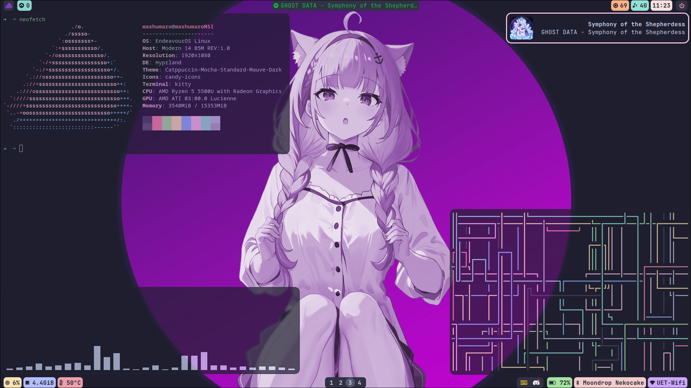
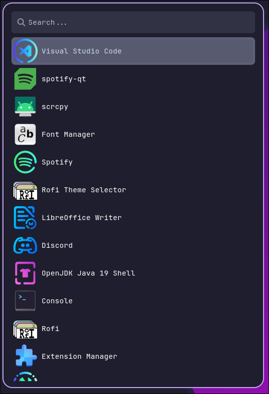

# dots
My Hyprland + Waybar config with Catppuccin theme

- OS: EndeavourOS
- DE: Hyprland
- Bars: Waybar
- Notification: Dunst
- Terminal: Kitty
- Shell: zsh
- Theme: Catppuccin Mocha Mauve
- Icon: Candy Icons
- Fetch: Neofetch
- Visualizer: Cava
- Text Editor: Neovim

## Screenshot

*My RAM usage is high because I have some apps running in the background, don't judge me xD*

*I have both wofi and rofi (obviously Wayland-compatible version). Wofi for launching apps and rofi for power, bluetooth and wifi menu*

## Wallpaper

This wallpaper is an edit I made from the [original pic](https://www.pixiv.net/en/artworks/106654974) using Photoshop.
